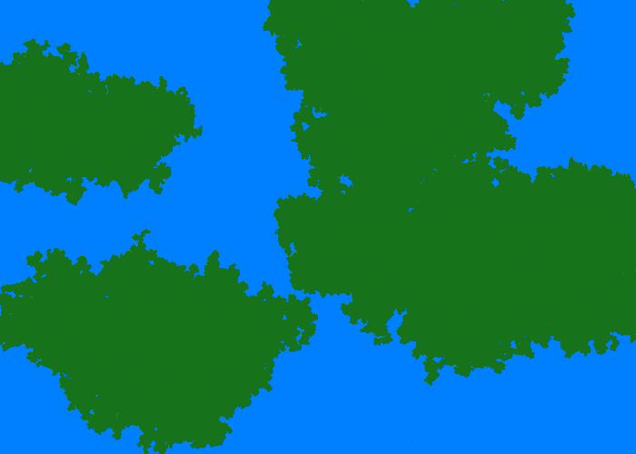

TerrainGenerator
================

A terrain generation experiment using seed growing

Run using this command
	
	python runner.py

This will generate a file called map.png
Modify the arguments to the TerrainGenerator constructor in runner.py

On OSX I use this command
	
	python runner.py && open map.png

Sample generated map:
