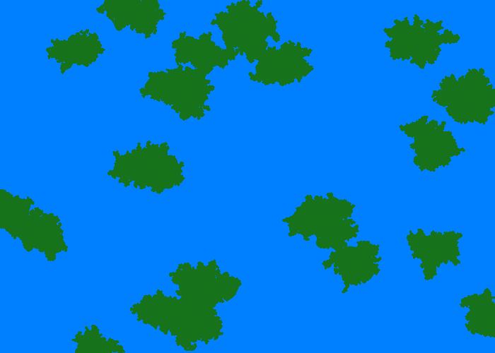

TerrainGenerator
================

A terrain generation experiment using seed growing

Run using this command
	
	python runner.py

These are the optional command line arguments

	usage: runner.py [-h] [-width WIDTH] [-height HEIGHT]
                 [-growth-threshold GROWTH_THRESHOLD] [-decay-rate DECAY]
                 [-number-of-seeds NUM_SEEDS] [-filename FILENAME]

	A small program to generate simple terrains using seed growing

	optional arguments:
	  -h, --help            show this help message and exit
	  -width, -w WIDTH
	                        The width of the generated image - default is 500
	  -height, -he HEIGHT
	                        The height of the generated image - default is 500
	  -growth-threshold, -g GROWTH_THRESHOLD
	                        The growth threshold above which a seed stops growing - default is 0.9
	  -decay-rate, -d DECAY
	                        The rate at which the growth threshold decreases - default is 0.01
	  -number-of-seeds, -n NUM_SEEDS
	                        The number of seeds to grow land from - deafult is 10
	  -filename, -f FILENAME
	                        The output filename - deafults to map.png

On OSX I use this command
	
	python runner.py && open map.png

Sample generated maps:

